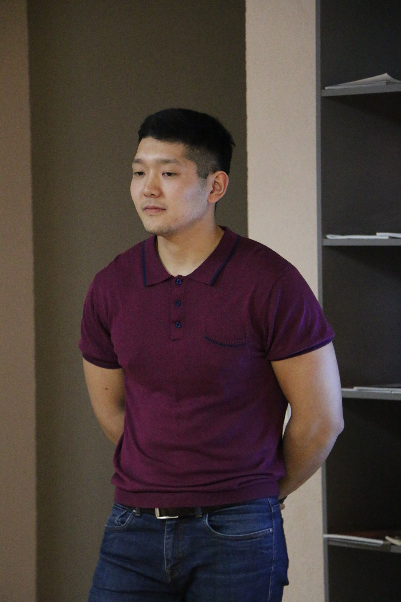

# **ARSTAN BEKBAEV**

After getting Master's degree as a Petroleum Engineer in 2014 I worked for the international drilling company for 4 years.  
3 years ago I’ve started to work for the Service Company as an engineer. I’ve gained the experience in maintenance, repairing and running to the well the advanced equipment in the International projects.

* Offshore Drilling
* Equipment maintenance
* Business correspondence
